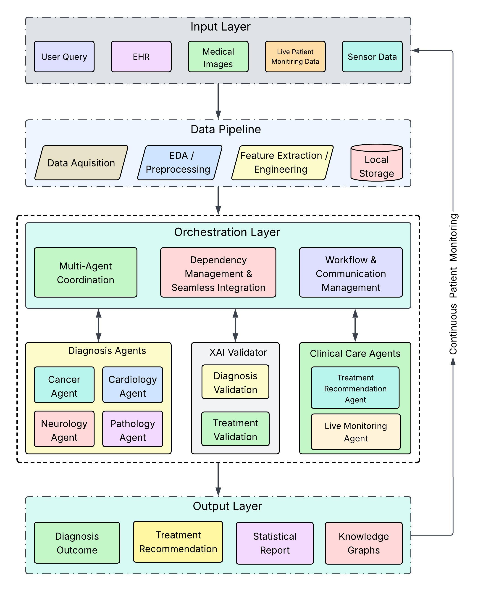

# Agentic AI Healthcare System

A multi-agent AI system for clinical decision support, built with FastAPI and LangChain. Specialist agents independently analyse patient data and produce structured diagnostic and treatment outputs, with an XAI validation layer that enforces clinical safety rules and ethical consistency before results are returned.

---

## Architecture




### Services

| # | Service | Description | Port |
|---|---------|-------------|------|
| 1 | **Cardiology Agent** | Analyses cardiac symptoms, flags anomalies, recommends cardiac workup | 8001 |
| 2 | **Neurology Agent** | Analyses neurological symptoms, recommends imaging and neurological tests | 8002 |
| 3 | **Cancer Agent** | Oncology assessment - TNM staging, tumour markers, biopsy and imaging guidance | 8003 |
| 4 | **Pathology Agent** | Analyses lab results and biomarker abnormalities | 8011 |
| 5 | **Treatment Agent** | Generates comprehensive treatment and patient care plans | 8012 |
| 6 | **Orchestrator Agent** | LangGraph master agent - classifier, ChromaDB cache, retry loops, XAI gating | 8015 |
| 7 | **XAI Validation Service** | LLM-based clinical safety validation with rule-based checks and SHAP explainability | 8016 |
| 8 | **Evaluation Service** | System monitoring and metrics calculation | 8017 |
| 9 | **ChromaDB** | Externalized vector store - shared by all agents for RAG and semantic caching | 8020 |
| 10 | **MongoDB** | Persistent storage - completed patient cases and evaluation reports | 27017 |
| 11 | **Patient UI** | Streamlit patient-facing web app - check-in, symptom input, and diagnosis report | 8021 |

---

## Swagger / OpenAPI / UI URLs

Each service exposes interactive API documentation via FastAPI's built-in Swagger UI and ReDoc.

| Service | Swagger UI | ReDoc |
|---------|-----------|-------|
| Cardiology Agent | http://localhost:8001/docs | http://localhost:8001/redoc |
| Neurology Agent | http://localhost:8002/docs | http://localhost:8002/redoc |
| Cancer Agent | http://localhost:8003/docs | http://localhost:8002/redoc |
| Pathology Agent | http://localhost:8011/docs | http://localhost:8011/redoc |
| Treatment Agent | http://localhost:8012/docs | http://localhost:8012/redoc |
| Orchestrator Svc | http://localhost:8015/docs | http://localhost:8015/redoc |
| XAI Validation Service | http://localhost:8016/docs | http://localhost:8016/redoc |
| Evaluation Service | http://localhost:8017/docs | http://localhost:8017/redoc |
| ChromaDB | http://localhost:8020/docs | http://localhost:8020/redoc |
| Patient UI | http://localhost:8021 | - |

---

## Service Documentation

Each service has its own detailed README covering API endpoints, implementation details, and local setup:

| Service | README |
|---------|--------|
| Cardiology Agent | [README.md](services/cardiology-agent/README.md) |
| Neurology Agent | [README.md](services/neurology-agent/README.md) |
| Cancer Agent | [README.md](services/cancer-agent/README.md) |
| Pathology Agent | [README.md](services/pathology-agent/README.md) |
| Treatment Agent | [README.md](services/treatment-agent/README.md) |
| Orchestrator Agent | [README.md](services/orchestrator-agent/README.md) |
| XAI Validation Service | [README.md](xai-validation-service/README.md) |
| Evaluation Service | [README.md](services/evaluation-service/README.md) |
| Patient UI | [README.md](patient-ui/README.md) |

---

## Error Response

All services return a consistent error envelope on failure.

## Error Response

All services return a consistent error envelope on failure.

```json
{
  "is_success": false,
  "error": {
    "code": "LLM_INVOCATION_ERROR",
    "message": "LLM call failed for patient P001: <detail>"
  }
}
```

| Error Code | Description |
|------------|-------------|
| `LLM_INVOCATION_ERROR` | The LLM call to the specialist agent failed |
| `LLM_RESPONSE_PARSE_ERROR` | The LLM response could not be parsed into the expected structure |
| `VALIDATION_LLM_ERROR` | The XAI validator LLM call failed |
| `VALIDATION_PARSE_ERROR` | The XAI validator response could not be parsed |
| `INTERNAL_SERVER_ERROR` | Unhandled internal error |

---

## Running Locally

Each service is independent. See the service-specific README linked in the [Service Documentation](#service-documentation) table above for setup steps, environment variables, and port numbers.

**Common requirement for all services:** set `OPENAI_API_KEY` in your environment or a `.env` file before starting.

---

## ChromaDB - Externalized Vector Store

ChromaDB runs as a standalone HTTP server (not embedded) so that:
- All agents share a single vector store instance
- Data persists across restarts via a bind-mounted host directory
- The `chroma_data/` folder is excluded from git (too large; ~300 MB after loading MIMIC-IV)

### Running ChromaDB locally (without Docker)

Set the `CHROMA_DATA_PATH` environment variable to your chosen storage directory, then start the server:

```bash
# Git Bash
export CHROMA_DATA_PATH="Path_to_Chroma_DB/chroma_data"
chroma run --host 127.0.0.1 --port 8020 --path "$CHROMA_DATA_PATH"
```

Verify it is running:
```bash
curl http://localhost:8020/api/v1/heartbeat
```

### ChromaDB collections

| Collection | Used By | Purpose |
|------------|---------|---------|
| `mimic_cancer_cases` | Cancer Agent | MIMIC-IV RAG - historical oncology cases for context retrieval |
| `diagnosis_outcomes` | Orchestrator | Semantic cache of validated diagnoses |
| `treatment_outcomes` | Orchestrator | Semantic cache of validated treatment plans |

### Loading MIMIC-IV data into ChromaDB

After ChromaDB is running, load oncology cases from BigQuery (requires GCP credentials):

```bash
cd services/cancer-agent
python scripts/load_mimic_data.py --project YOUR-GCP-PROJECT-ID --limit 50000
```

### Reusing locally loaded data with Docker

Set `CHROMA_DATA_PATH` before running Docker Compose so that the container bind-mounts your existing data directory:

```bash
# Git Bash
export CHROMA_DATA_PATH="Path_to_Chroma_DB/chroma_data"
docker-compose up --build
```

The `docker-compose.yml` maps this path into the ChromaDB container at `/chroma/chroma`, so all previously loaded vectors are immediately available - no reload required.

---

## MongoDB - Persistent Storage

MongoDB stores all completed patient cases and evaluation reports. It runs as a standalone container with data persisted to a host directory via `MONGO_DB_PATH`.

### Running MongoDB locally (without Docker)

```bash
# Start MongoDB on the default port
mongod --dbpath "$MONGO_DB_PATH" --port 27017 --quiet
```

Verify it is running:
```bash
mongosh --eval "db.adminCommand('ping')"
```

### MongoDB collections

| Collection | Used By | Purpose |
|------------|---------|---------|
| `mimic_iv_records` | Cancer Agent, Evaluation Service | MIMIC-IV patient records for TF-IDF training and XAI evaluation |
| `cancer_agent_report` | Evaluation Service | Cancer Agent TF-IDF evaluation reports |
| `xai_evaluation_reports` | Evaluation Service | XAI validation evaluation reports |
| `xai_validation_rules` | XAI Validation Service | Clinical safety rules (seeded from JSON, overridden by MongoDB) |
| `patient_diagnosis_treatment_records` | Orchestrator Agent | Completed patient cases persisted after full pipeline run |

### Reusing locally stored data with Docker

Set `MONGO_DB_PATH` before running Docker Compose so that the container bind-mounts your existing data directory:

```bash
# Git Bash
export MONGO_DB_PATH="$MONGO_DB_PATH"
docker-compose up --build
```

The `docker-compose.yml` maps this path into the MongoDB container at `/data/db`, so all previously loaded data is immediately available — no reload required.

---

## Running with Docker Compose

```bash
# Git Bash - set both data paths before starting (required)
export CHROMA_DATA_PATH="Path_to_Chroma_DB/chroma_data"
export MONGO_DB_PATH="Path_to_Mongo_DB/mongo_data"
docker-compose up --build
```

---

## Observability — LangSmith Tracing

Seven services participate in a shared LangSmith project so a single patient case — orchestrator → specialist agent → XAI validator → treatment agent — shows up as **one connected trace tree**, not disconnected per-service traces: Cardiology, Neurology, Cancer, Pathology, Treatment, Orchestrator, and the XAI Validation Service.

### How distributed tracing works

Each of the seven services adds `LangSmithTracingMiddleware` (`src/core/tracing.py`) to its FastAPI app. On an incoming request, the middleware checks for a `langsmith-trace` header:
- **Present** (the call came from another traced service) → the middleware continues that trace via `tracing_context(parent=...)`, so this service's LLM/tool/graph runs nest under the caller's run.
- **Absent** (e.g. the orchestrator receiving a request from Patient UI) → this service's own invocation becomes a new root trace.

Every run is also tagged with the service name (e.g. `cardiology-agent`) so runs can be filtered within the shared project.

The orchestrator is the only service that calls sibling agent services over HTTP (`src/tools/*_client.py`). Each outbound call attaches `trace_headers()` (`src/core/tracing.py`), which reads the currently active LangSmith run via `get_current_run_tree()` and serializes it to the `langsmith-trace` / `baggage` headers the receiving service's middleware picks up.

No code changes are needed to trace individual LLM calls — LangChain/LangGraph/DeepAgents auto-instrument every `ChatOpenAI` call, tool invocation, and graph node once tracing is enabled via environment variables.

### Enabling tracing

Set these on the seven services (already wired into `docker-compose.yml`; export them before `docker-compose up`, or add to each service's `.env` when running locally):

| Variable | Default | Description |
|---|---|---|
| `LANGSMITH_TRACING` | `false` | Set `true` to enable tracing |
| `LANGSMITH_API_KEY` | — | Your LangSmith API key |
| `LANGSMITH_PROJECT` | `agentic-ai-healthcare-system` | Shared project — must be identical across all services so a case appears as one trace |
| `LANGSMITH_ENDPOINT` | `https://api.smith.langchain.com` | LangSmith API endpoint (change for EU/self-hosted) |

Tracing is off by default (`LANGSMITH_TRACING=false`) and has no effect on request/response behaviour when disabled — `Evaluation Service` and `Patient UI` are excluded, since neither makes LLM calls in the live diagnosis pipeline.

---

## Project Structure

```
agentic-ai-healthcare-system/
├── services/
│   │
│   ├── cardiology-agent/           # Cardiology Specialist - port 8001
│   │   ├── Dockerfile
│   │   ├── requirements.txt
│   │   └── src/
│   │       ├── agent/              # DeepAgent executor + @tool (cardiology_agent.py)
│   │       ├── api/                # FastAPI router (server.py)
│   │       ├── core/               # config.py, tracing.py (LangSmith middleware) - OPENAI_DEFAULT_MODEL env var
│   │       ├── datamodel/          # Pydantic request/response models
│   │       ├── exception/          # CardiologySvcException + handler
│   │       ├── service/            # Business logic (cardiology_service.py)
│   │       ├── log/
│   │       └── main.py
│   │
│   ├── neurology-agent/            # Neurology Specialist - port 8002
│   │   ├── Dockerfile
│   │   ├── requirements.txt
│   │   └── src/
│   │       ├── agent/              # DeepAgent executor + @tool (neurology_agent.py)
│   │       ├── api/                # FastAPI router (server.py)
│   │       ├── core/               # config.py, tracing.py (LangSmith middleware) - OPENAI_DEFAULT_MODEL env var
│   │       ├── datamodel/          # Pydantic request/response models
│   │       ├── exception/          # NeurologySvcException + handler
│   │       ├── service/            # Business logic (neurology_service.py)
│   │       ├── log/
│   │       └── main.py
│   │
│   ├── cancer-agent/               # Cancer / Oncology Specialist - port 8003
│   │   ├── Dockerfile
│   │   ├── requirements.txt
│   │   ├── scripts/
│   │   │   ├── load_mimic_data.py  # Load MIMIC-IV oncology cases into ChromaDB
│   │   │   ├── load_mimic_mongo.py # Load MIMIC-IV cases into MongoDB
│   │   │   └── train_models.py     # Train TF-IDF models and save to pickle for XAI SHAP
│   │   └── src/
│   │       ├── agent/              # DeepAgent + @tool: search_mimic_cases (cancer_agent.py)
│   │       ├── api/                # FastAPI router (server.py)
│   │       ├── core/               # config.py, tracing.py (LangSmith middleware) - OPENAI_DEFAULT_MODEL, CHROMA_*, MONGO_* env vars
│   │       ├── datamodel/          # Pydantic request/response models
│   │       ├── exception/          # CancerSvcException + handler
│   │       ├── rag/                # MIMIC-IV ChromaDB retriever + TF-IDF predictor
│   │       ├── service/            # Business logic (cancer_service.py)
│   │       ├── log/
│   │       └── main.py
│   │
│   ├── pathology-agent/            # Pathology Specialist - port 8011
│   │   ├── Dockerfile
│   │   ├── requirements.txt
│   │   └── src/
│   │       ├── agent/              # DeepAgent executor + @tool (pathology_agent.py)
│   │       ├── api/                # FastAPI router (server.py)
│   │       ├── constant/           # constants.py - PATHOLOGY_AGENT_ID
│   │       ├── core/               # config.py, tracing.py (LangSmith middleware) - OPENAI_DEFAULT_MODEL env var
│   │       ├── datamodel/          # Pydantic request/response models
│   │       ├── exception/          # PathologySvcException + handler
│   │       ├── service/            # Business logic (pathology_service.py)
│   │       ├── log/
│   │       └── main.py
│   │
│   ├── treatment-agent/            # Treatment & Patient Care Agent - port 8012
│   │   ├── Dockerfile
│   │   ├── requirements.txt
│   │   └── src/
│   │       ├── agent/              # LangChain LLM executor (treatment_agent.py)
│   │       ├── api/                # FastAPI router (server.py)
│   │       ├── core/               # tracing.py (LangSmith middleware)
│   │       ├── datamodel/          # Pydantic request/response models
│   │       ├── exception/          # TreatmentSvcException + handler
│   │       ├── service/            # Business logic (treatment_service.py)
│   │       ├── log/
│   │       └── main.py
│   │
│   ├── orchestrator-agent/         # Router / Master Agent - port 8015
│   │   ├── Dockerfile
│   │   ├── requirements.txt
│   │   └── src/
│   │       ├── agents/             # LangGraph graph, nodes, state, classifier router
│   │       ├── api/                # FastAPI router (server.py)
│   │       ├── core/               # config.py, chroma_client.py, mongo_client.py, tracing.py (LangSmith middleware + trace_headers())
│   │       ├── exception/          # OrchestratorSvcException + handler
│   │       ├── schemas/            # Shared request/response schemas
│   │       ├── tools/              # HTTP client wrappers for specialist agents + XAI
│   │       ├── training/           # ClinicalBERT training script
│   │       ├── log/
│   │       └── main.py
│   │
│   └── evaluation-service/         # Metrics & Evaluation Service - port 8017
│       ├── Dockerfile
│       ├── requirements.txt
│       └── src/
│           ├── api/                # FastAPI router (server.py)
│           ├── core/               # config.py, mongo_client.py
│           ├── datamodel/          # Request/response models
│           ├── evaluators/         # metrics_calculator, system_monitor, label_mapper,
│           │                       #   tfidf_baseline_evaluator, xai_evaluator
│           ├── graph/              # Matplotlib/Seaborn report graph generators
│           ├── service/            # Background thread orchestration (evaluation_service.py)
│           ├── exception/
│           ├── log/
│           └── main.py
│
├── xai-validation-service/         # XAI & Ethical Validator - port 8016
│   ├── Dockerfile
│   ├── requirements.txt
│   └── src/
│       ├── api/                    # FastAPI router (server.py)
│       ├── core/                   # tracing.py (LangSmith middleware)
│       ├── datamodel/              # Validation request/response models
│       ├── exception/              # ValidationSvcException + handler
│       ├── explainers/             # SHAP-based explainability (shap_provider.py)
│       ├── service/                # Business logic (validator_service.py)
│       ├── validators/             # Rule-based checks + ethical_guard LLM validator
│       ├── log/
│       ├── constants.py
│       └── main.py
│
├── patient-ui/                     # Patient-facing Streamlit Web App - port 8021
│   ├── Dockerfile
│   ├── requirements.txt
│   ├── app.py                      # Entry point - redirects to patient check-in
│   ├── run.sh                      # Starts Streamlit on port 8021
│   ├── components/
│   │   └── banner.py               # Shared top-bar and footer components
│   ├── constant/
│   │   └── constants.py            # ORCHESTRATOR_URL_DEFAULT, MAX_SYMPTOMS_CHARS
│   └── pages/
│       ├── 1_patient_login.py      # Patient check-in page
│       └── 2_diagnosis.py          # Symptom input + diagnosis report page
│
├── docker-compose.yml              # Full stack orchestration (all services + infra)
└── README.md
```